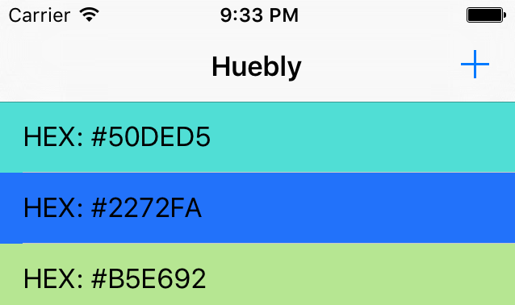

# Huebly

Experimenting architecture by building a color storing app.

## Requirements

- [Ruby](https://www.ruby-lang.org/en/)
- [Xcode](https://developer.apple.com/xcode/)

## Usage

To install dependencies, run the following commands:
```bash
make install
```

To run tests, run the following commands:
```bash
make test
```

# Screenshots

